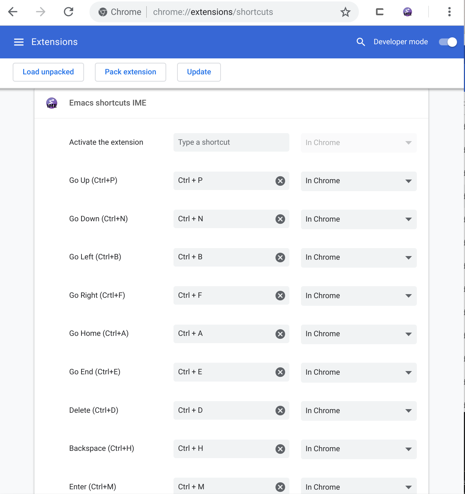
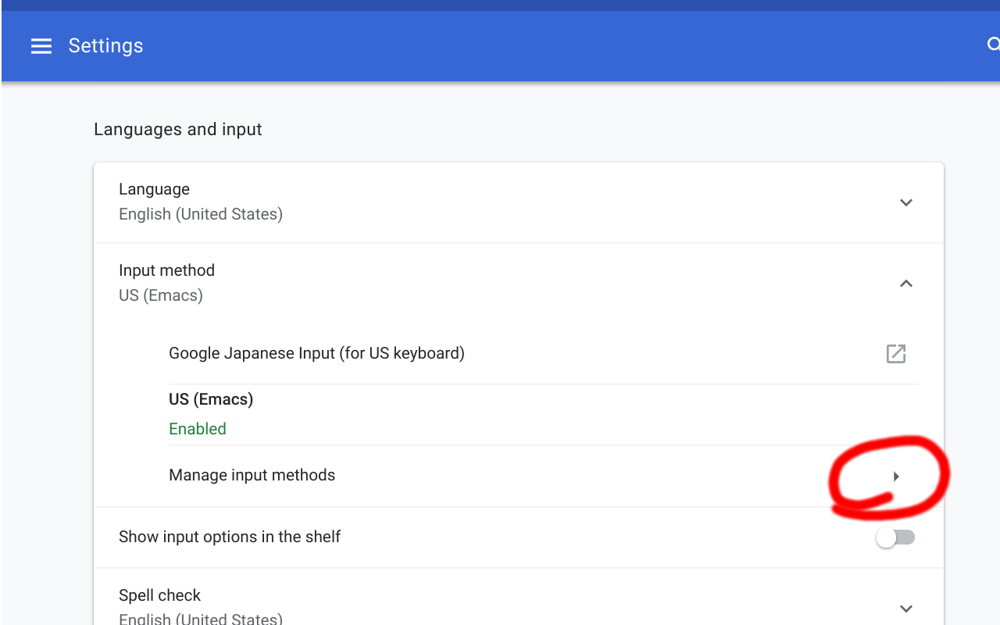
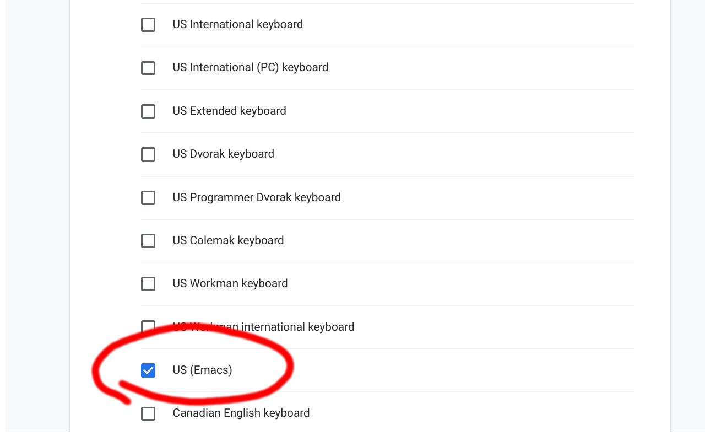
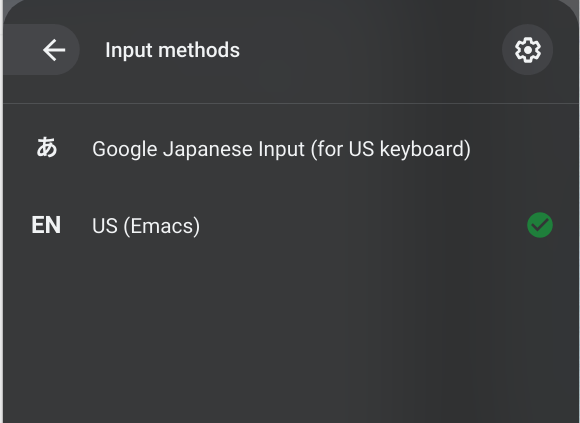

# Emacs keybind on ChromeOS

Enables emacs like keybindings on ChromeOS as an IME.

## How to use (Read carefully)

* Install this extension [here](https://chrome.google.com/webstore/detail/emacs-shortcuts-ime/mkegpdcnenfnhenaliggngipehndddne)
* Set shortcuts at [chrome://extensions/shortcuts](chrome://extensions/shortcuts) like below

* Enable `US(Emacs)` IME in Input Method Setting

* Select US(Emacs) IME

* Confirm that you are using the IME, and Enjoy!

## FAQ

### Why have to set shortcuts manually?

Google allows only 4 key shortcuts. `Ctrl+B`, `Ctrl+E`, `Ctrl+Y`, `Ctrl+M` are enabled by default (These are possible because they are not used by Chrome.). You have to set others to be enabled by yourself at [chrome://extensions/shortcuts](chrome://extensions/shortcuts) .

### Is it possible to use original shortcuts?
                           
No. The shortcuts like `Ctrl+F` for search is disabled. 

### Supported Commands

* Ctrl+P (Up)
* Ctrl+N (Down)
* Ctrl+B (Left)
* Ctrl+F (Right)
* Ctrl+A (Home)
* Ctrl+E (End)
* Ctrl+D (Delete)
* Ctrl+H (Backspace)
* Ctrl+M (Enter)
* Ctrl+K (Kill line to end)
* Ctrl+W (Cut)
* Ctrl+Y (Paste)

## License

BSD-2
